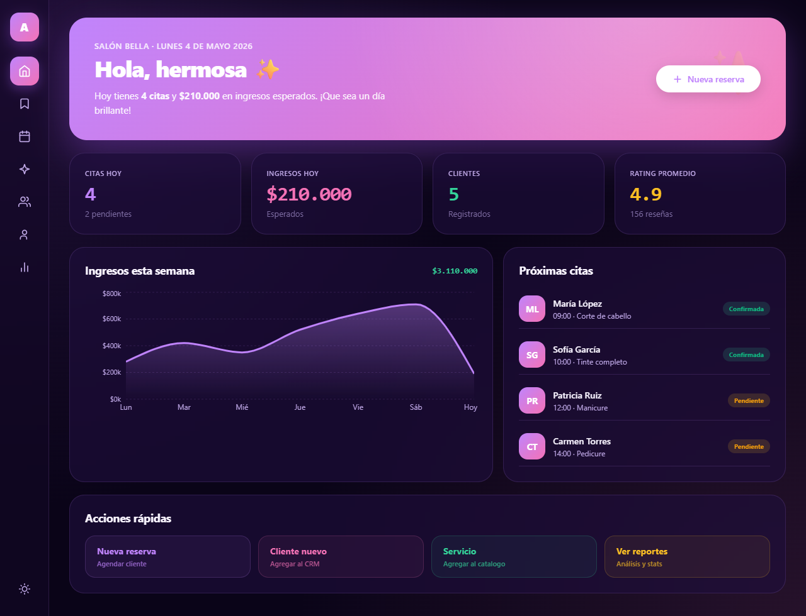
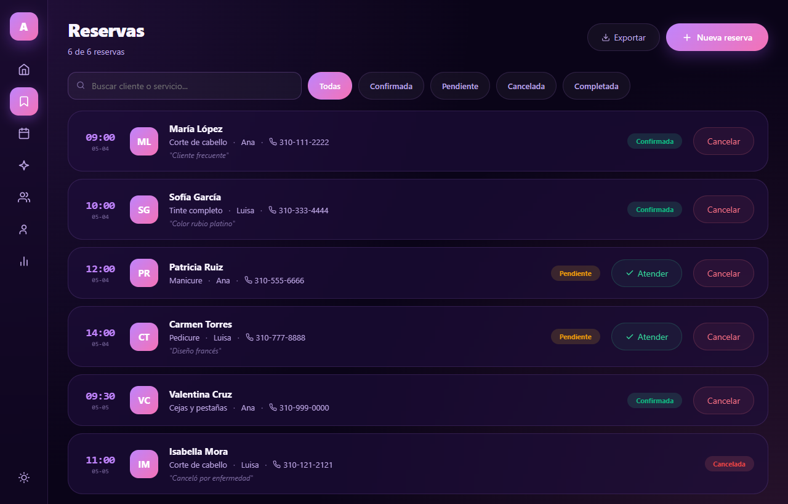
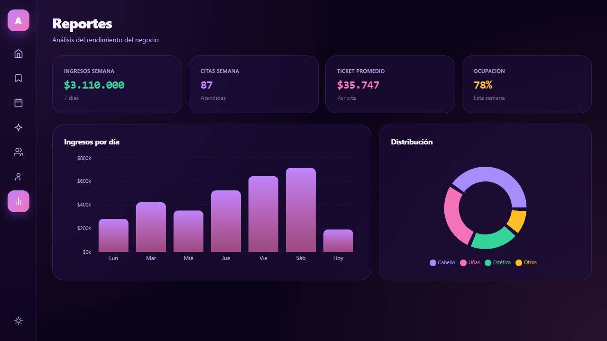

# AgendaPro — Salon Booking & CRM

[](https://github.com/Juanmaya25/agendapro-bookings/actions/workflows/ci.yml)
[](https://github.com/Juanmaya25/agendapro-bookings/actions/workflows/deploy.yml)
[](https://opensource.org/licenses/MIT)

> An appointment-booking platform and lightweight CRM for beauty salons, hair studios and spas — a 3-step booking wizard, month calendar, client loyalty tracking, team management and revenue analytics, in a glassmorphism UI with light/dark themes.

**Live demo → [juanmaya25.github.io/agendapro-bookings](https://juanmaya25.github.io/agendapro-bookings)**



> Dashboard: gradient hero with the day's snapshot, KPI cards, a weekly-revenue area chart and the upcoming-appointments feed.



> Bookings: searchable, status-filtered appointment list with inline "attend" and "cancel" actions.



> Analytics: revenue-per-day bars and a service-mix donut, with average-ticket and occupancy KPIs.

---

## The problem

A neighbourhood salon loses money in two invisible ways: no-shows it never reminded, and a client list that lives in a notebook. The owner doesn't want enterprise scheduling software — she wants to add an appointment in under ten seconds, see who's coming today, know which clients are worth a loyalty perk, and glance at whether this week beat last week.

AgendaPro models that daily reality: a guided booking flow (service → time → client), a visual month calendar, a CRM with loyalty tiers and lifetime spend, a stylist roster, and a small analytics view — all in Colombian pesos and tuned to feel warm and premium rather than clinical.

## Architecture

Client-side React SPA (no backend; seed data ships in-bundle and lives in component state), organised by responsibility:

```
src/
├── App.jsx                 # Orchestrator: state, business actions, page routing (~250 lines)
├── main.jsx                # React entry point
├── index.css               # Reset, scrollbars, fade-in, responsive grid + sidebar breakpoints
├── data/
│   ├── seed.js             # Services, bookings, clients, stylists, weekly stats, service mix
│   └── themes.js           # Dark/light glass palettes + status & loyalty color maps
├── utils/
│   ├── format.js           # COP currency formatting
│   ├── csv.js              # CSV serialisation + browser download
│   ├── ids.js              # Sequential ID + random service color
│   └── styles.js           # Theme-derived inline style factory (glass system)
├── hooks/
│   └── useToast.js         # Auto-dismissing toast with timer cleanup
├── components/
│   ├── icons.jsx           # Inline SVG icon set (nav + UI, no icon dependency)
│   ├── Sidebar.jsx         # Icon rail nav + theme toggle
│   ├── Modal.jsx, ConfirmDialog.jsx, Toast.jsx
│   ├── BookingWizard.jsx   # 3-step booking flow (service / time / client)
│   ├── ServiceForm.jsx, ClientForm.jsx
└── pages/
    ├── Dashboard.jsx       # Hero, KPIs, weekly revenue, upcoming appointments
    ├── Bookings.jsx        # Searchable/filterable appointment list
    ├── Calendar.jsx        # Auto-generated month grid with per-day bookings
    ├── Services.jsx        # Service catalogue cards with CRUD
    ├── Clients.jsx         # CRM cards with loyalty tier + lifetime spend
    ├── Team.jsx            # Stylist roster with rating & appointment counts
    └── Analytics.jsx       # Revenue bars + service-mix donut
```

## Key decisions

| Decision | Why |
|---|---|
| **Refactored a monolithic `App.jsx` (~1,070 lines) into `data / utils / hooks / components / pages`** | The original held seed data, a glass design system, seven page renderers and three modal flows in one file. Splitting by concern makes the booking wizard, the calendar generator and the CRM independently readable and testable — with the rendered UI kept identical. |
| **Booking wizard extracted as a self-contained stepper** | The 3-step flow (service → time → client) is the product's core interaction, so it lives in its own component with the step gating handled by the orchestrator — easy to extend to a 4th step (deposit, reminders) without touching pages. |
| **Glassmorphism via a `makeStyles(C)` factory** | Backdrop-blur cards, gradient buttons and both themes derive from a single palette object, so light/dark is one state toggle and every surface stays visually consistent. |
| **Calendar generated from `Date`, not hard-coded** | The month grid computes its first-day offset and day count at runtime, so it stays correct in any month without a date library. |
| **Pure utilities (`format`, `csv`, `ids`) covered by unit tests** | The logic most likely to regress silently is isolated and tested directly. |

## Tech stack

- **React 18** — hooks, `useMemo`, `useCallback`
- **Vite 5** — dev server + build
- **Recharts** — area, bar and pie charts
- **Vitest + Testing Library + jsdom** — unit and component tests
- **GitHub Actions + GitHub Pages** — CI (test + build) and CD

## Tests

```bash
npm test
```

15 tests across four suites:

- `utils/format.test.js` — COP formatting, null/NaN handling
- `utils/ids.test.js` — sequential ID generation, random color shape
- `utils/csv.test.js` — header building, quote escaping, row serialisation
- `App.test.jsx` — render smoke test, tab navigation, search filtering, theme toggle

CI runs the full suite and a production build on every push and pull request.

## Run locally

```bash
git clone https://github.com/Juanmaya25/agendapro-bookings.git
cd agendapro-bookings
npm install
npm run dev      # http://localhost:5173/agendapro-bookings/
npm test         # run the test suite
npm run build    # production build to dist/
```

## Author

**Juan José Maya** — Full Stack Developer · San Pedro, Antioquia, Colombia

- Portfolio: [juanmaya25.github.io](https://juanmaya25.github.io)
- GitHub: [@Juanmaya25](https://github.com/Juanmaya25)
- Email: [juanjosemaya2510@gmail.com](mailto:juanjosemaya2510@gmail.com)

## License

MIT © Juan José Maya
